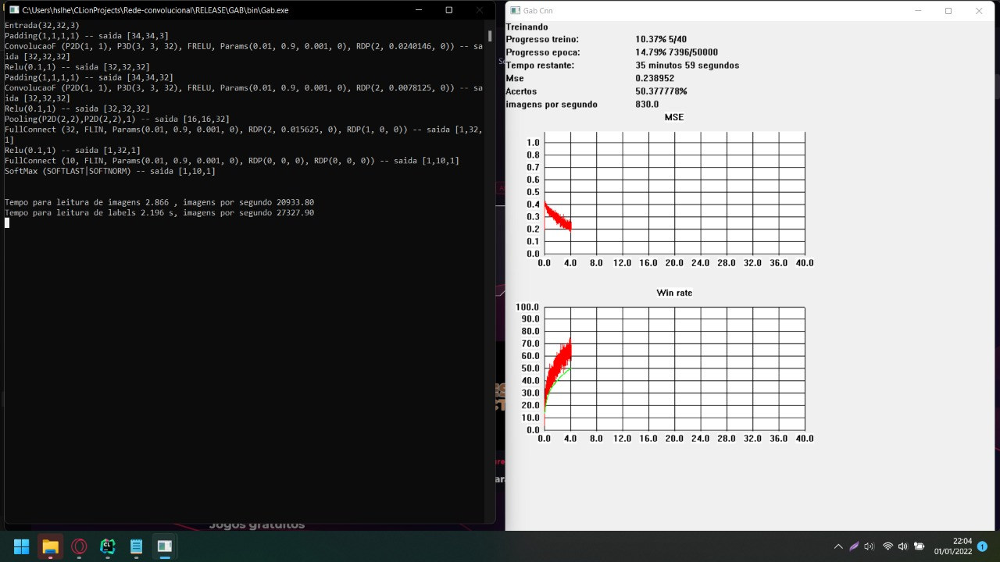
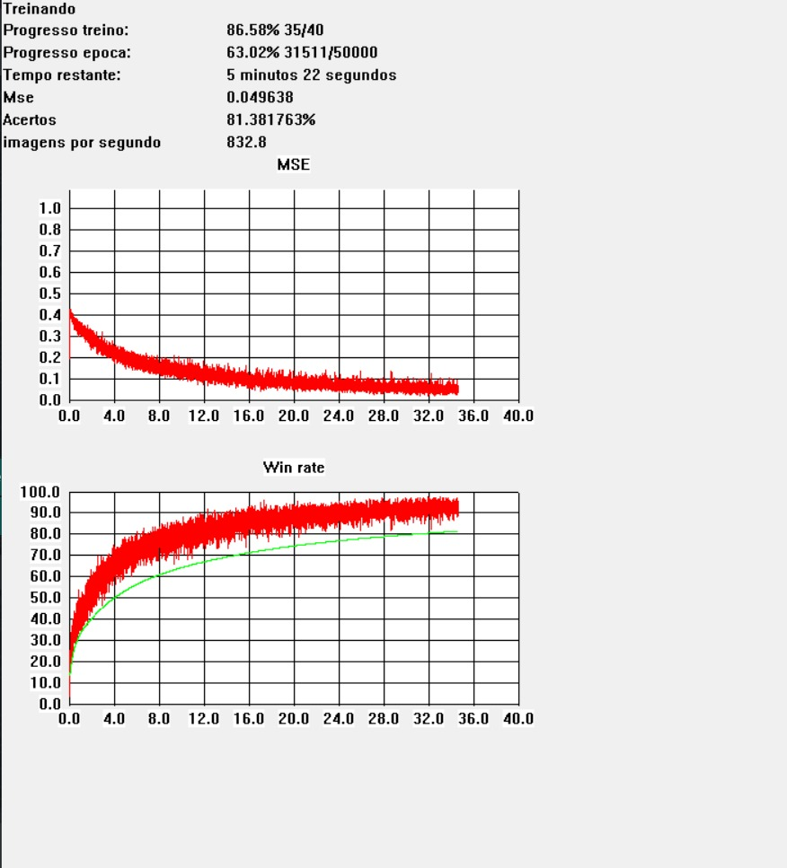
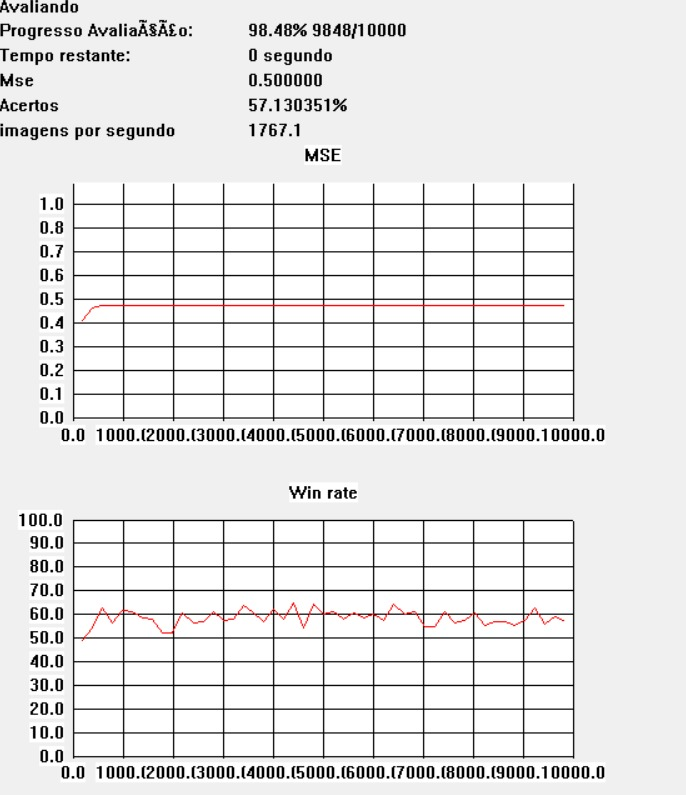

# Rede-convolucional
Iniciacao cientifíca ufu 2020
Rede convolucional em c com computacao paralela

#### [Documentação](https://xx220xx.github.io/Rede-convolucional/)

## A versão 3.0.0 Está disponível
#### [Download](https://github.com/Xx220xX/Rede-convolucional/releases)
#### Notas:
- Nova interface, utilizando win32 api
- Bibliotecas internas reescritas e otimizadas
- Kernels em uma dll separada (Facilita atualizações)
- Camada [ConvolucionalF](https://xx220xx.github.io/Rede-convolucional/) adicionada 
- Corrigido vanish gradiente para todas camadas
- Mudanças na inteface lua, veja a [documentação](https://xx220xx.github.io/Rede-convolucional/) para mais detalhes.
- Grafico de aprendizado 

#### Futuras atualizações

- [ ] Menu com opções
- [ ] Testar imagens na rede
- [ ] Criar Imagens e testa-la em diferentes redes
- [ ] Fix PRelu's fields.
- [ ] Criar documentação C completa

_____
#### Screenshots

##### Cifar 10

