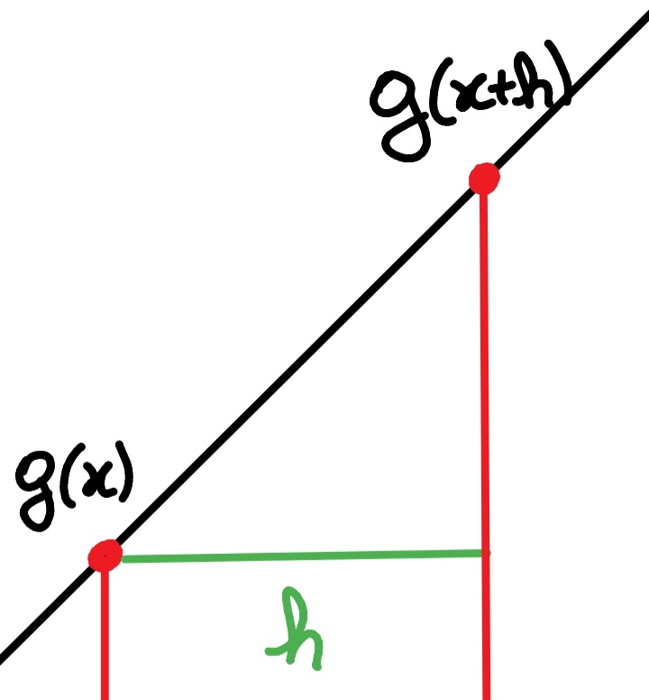
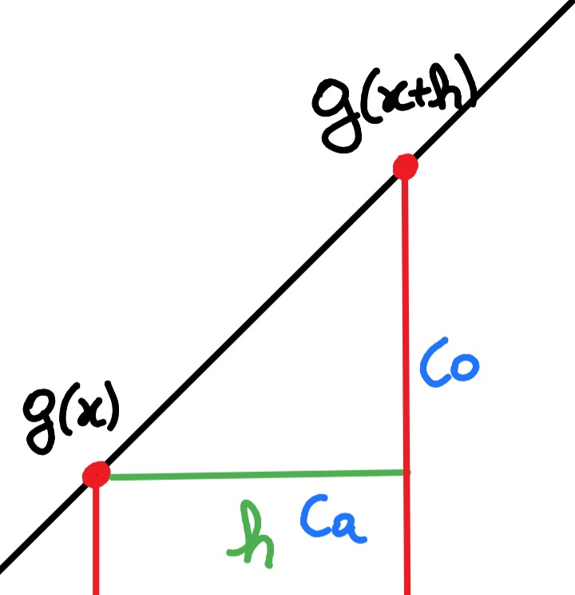

<!DOCTYPE html>
<html>
<head>
	<title>Camada FullConnect</title>
</head>
<body>
	<section>
		<h2>Teoria</h2>
		

			Esta camada possui grande importância no aprendizado da rede, 
			uma vez que os neuronios de saída estão  todos conectados aos neuronios de entrada.
			Independente da dimensão da entrada, a dimensão de saída é definida sem restrição.
		

		<h3>Predição</h3>
		

			Também  chamado  de feedforward, é o processo que gera uma saída
			a partir de uma entrada. Consiste na multiplicação matricial dos seus pesos pela entrada e em seguida aplicando uma
			<a href="funcaoAtivação.md">função de ativação<a/>.
			

			

				
				Matriz de entrada ordem nx1x1
			

			

				
				Matriz de pesos ordem mx1x1
			

			
É feito a multiplicação de matrizes

			

				
				resulta em uma matriz mx1x1.
			

			

				Estudos mostraram que uma rede neural com apenas uma multiplicação linear é capaz de resolver apenas problemas lineares.
				Portanto é aplicado uma função não linear, agora podendo resolver problemas não lineares.
			

			

				
				resulta em uma matriz mx1x1 a qual é a saída desta camada.
			

			<h3>Retropropagação</h3>
			
Para esta  camada o método  utilizado é o gradiente descendente. Pela teoria do cálculo 
				o gradiente fornece a direção  de crescimento de uma função, para mostrar isso basta analisar a definição 
				da derivada. (Por simplicidade considerar espaço R²).
			

			<h4>o que é Derivada e qual sua importância para o método gradiente descendente</h4>
			

				
Seja 
					uma função contida em R².
					

						A derivada é definida por:
					

					

						
					

				

				

					

						
						Ao lado é visto graficamente. O  subtração dos pontos
						
						e
						
						fornece o cateto oposto do triangulo formado.
						E o  o cateto adjacente.
					

				

				

					

						
						Conforme mostrado na figura, a derivada então equivale ao calculo da tangente no ponto, uma vez que o limite está aplicado.
						Se o ponto 
						
						estiver mais alto que o ponto
						
						então a inclinação é positiva logo a tangente é positiva e a derivada também positiva, indicando que a medida que o valor
						
						aumenta (vai para a direita) a função 
						
						tende a aumentar.
						

							Caso o ponto 
							
							estiver mais baixo que o ponto
							
							então a inclinação é negativa logo a tangente é negativa e a derivada também negativa, indicando que a medida que o valor
							
							diminui (vai para a esquerda) a função 
							
							tende a aumentar.
						

					

				

				

					

						Resumindo, a derivada fornece a direção de crescimento da função. Para o caso de 
						
						é chamado de <a href="https://www.infopedia.pt/dicionarios/lingua-portuguesa/gradiente">Gradiente</a>
					

				

			

			<h4>Aplicando o método gradiante descendente</h4>
			

				

					Sabendo que é possível determinar a direção de crescimento de uma função, o próximo passo é definir uma função 
					para ser maximizada (no caso uma função de recompensa) ou uma função a ser minimizada (uma função de erro).
				

				

					No gradiente descendente é usado a função de erro médio quadrático, o objetivo é diminuir o erro final.
					A preocupação agora é em determinar o gradiente da matriz 
					
					para então caminhar na direção oposta a fim de diminuir o erro. (Caminhar na direção do gradiente vai fazer com que o erro aumente).				
				

				

					Considerando a função de erro como
					
					queremos encontrar 
					
					.
				

				

					
				

				

					
				

				

					Fazendo as derivadas obtém-se:
				

				

					
					Este é fornecido pelas próximas camadas, caso seja a ultima camada, então :
					

						, onde 
						 é o vetor de saída esperada no final da rede.
					

				

				

					
					Este é a derivada da função de ativação.
				

				

					
				

				

					
				

				

					
				

				

					Com o gradiente dos pesos definidos os pesos são corrigidos andando na direção oposta do gradiente
					

					
					, Onde h é um parâmetro chamado taxa de aprendizado. Usado pois o oposto do gradiente indica apenas a direção que a função decresce, não informando a distância até o minimo.
					

				

				

					O gradiente de entrada, útil para as camadas anteriores aplicarem este método, é expresso por:
				

				
				

			

		</section>
		<section>
			<h2>Exemplo numérico</h2>
			

				

					Seja uma camada fullconnect com entrada 3x1x1 e saída 2x1x1 com taxa de aprendizado igual a 1 . A matriz w aleatoriamente inicializada:
				

				

					
				

				

					Para uma entrada "a", a saída esperada é "t".
				

				

					
				

				

					
				

				

					A primeira parte é a obtenção da matriz z, resultante da multiplicação de "w" por "a"
				

				

					
				

				

					Passando pela função de ativação (para este exemplo a sigmoid).
				

				

					
				

				

					A saída obtida é diferente da esperada, então é feito a retropropagação a fim de obter uma resposta mais próxima. 
				

				

					
				

				

					
				

				

					
				

				

					Assim os pesos podem ser corrigidos para :
				

				

					
				

				

					Este processo é repetido  diversas vezes até atingir um erro final permitido dependendo da aplicação.
				

			

		</section>
	</body>
	</html>
